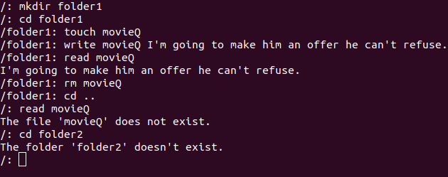

Completely Fake File System (CFFS)
==================================
<<<<<<< HEAD
This is not a working file system, and cannot be mounted.<br\>
=======
This is not a working file system, and cannot be mounted.\
>>>>>>> 22a894f08b9b47709a8034550287d6895177c885
This programs simulates the disk and partition and temporarily saves
data in memory.

# Functions

void  diskInit();                                      // Formats the disk, creates superblock and root directory<br\>
void  diskRead(char *filename);                        // Allows user to read "file" data<br\>
void  formatDisk();                                    // Sets disk values to 0 and fills directory array to empty strings<br\>
void  createSuperblock();                              // Creates superblock<br\>
void  createInode(int index);                          // Initializes inode with file size of 0<br\>
void  createRoot();                                    // Creates root directory (Makes file)<br\>
void  makeFile(int index,char *filename);              // Creates an inode for a file and saves file name to fileNames array<br\>
void  writeFile(char *filename,char *str);             // Writes data to a given file<br\>
void  deleteFile(char *fileName);                      // Deletes a file<br\>
void  mkDir(int index,char *dirName);                  // Makes a new directory on the disk<br\>
void  changeDir(char *dir);                            // Changes directory<br\>
void  shell();                                         // Runs the shell until user exits<br\>
void  printString();                                   // Prints a string<br\>
void  execute(char ** args);                           // Depending on input will execute disk functions<br\>
int   blockOffser(int index);                          // Used for calculating datablock locations<br\>
int   inodeOffset(int index);                          // Used for calculating inode locations<br\>
int   getFile(char *fileName);                         // Used for getting file index for inode calculations<br\>
int   getDirIndex(char *dir);                          // Used for getting directory index for inode calculations<br\>
int   getFreeInode();                                  // Gets the location of the next free inode<br\>
int   getFreeBlock();                                  // Gets the location of the next data block<br\>

# Shell Operations
touch &nbsp; 'Filename'                                   //Creates files<br\>
mkdir &nbsp; 'Directory'                                  //Creates folders<br\>
cd &nbsp;    'Directory'                                  //Changes directories<br\>
rm &nbsp;    'Filename'                                   //Removes files<br\>
write &nbsp; 'Filename' 'String'                          //Writes given input to files<br\>
read &nbsp;  'Filename'                                   //Reads from files and prints to terminal<br\>
# Example Output

